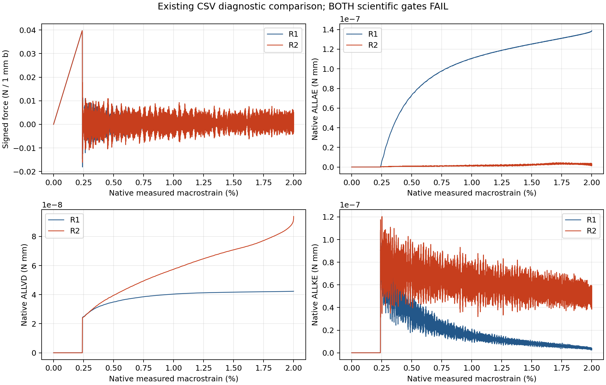
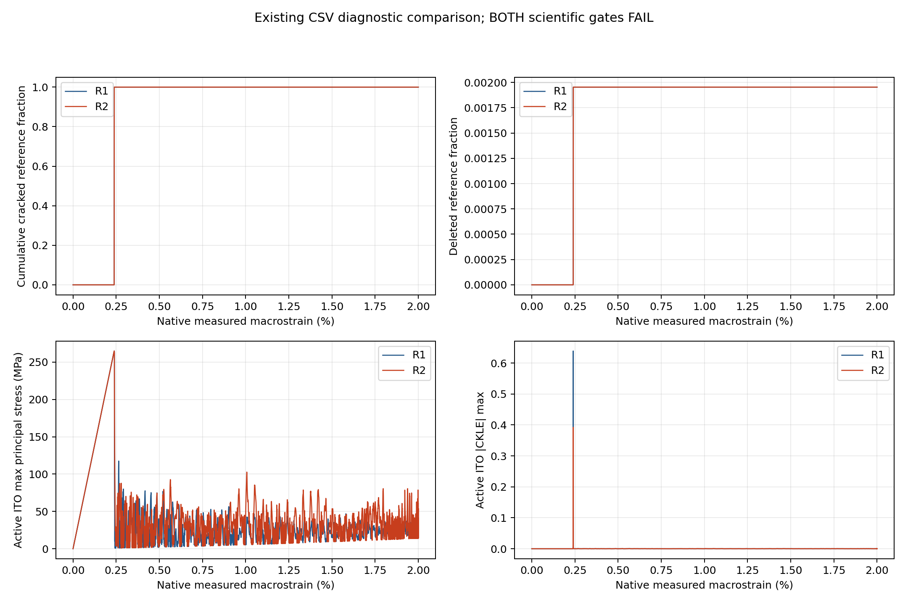

# R1/R2：已有本地 CSV 比较恢复报告

## 范围与结论

本次仅恢复本地 CSV 标量比较。原正常比较因文本列中的空字符串被转换为 float 而失败；原失败记录与源码保留。新入口保留 raw_geometry_operation_error 文本，缺失数值不补零。未重新求解、提取、运输、科学审计，未打开 ODB 或 NPZ。

**R1、R2 科学门均仍失败；本报告不构成物理路径验证、机制证明或收敛结论。**

R2 原生 global/ITO/PDMS ALLDC 均缺失；R1 ITO ALLDC 缺失。缺失项保持 UNAVAILABLE_NOT_ZERO，不能把关闭控制推定成原生零值。

## 原闭合科学审计结论（原样保留，未重算）

| 指标（各自 E* 归一化） | R1 | R2 | 原阈值 |
|---|---:|---:|---:|
| ALLAE | 10.3253933% | 0.295256001% | 5% |
| ALLVD | 3.14794784% | 6.00896628% | 5% |
| ETOTAL_drift | 1.10294004% | 6.31520494% | 1% |
| boundary_work_vs_ALLWK | 0.0104504936% | 0.0141003699% | 1% |
| ALLDC | 0% | 原生缺失 | 5% |

R1：ALLAE 和 ETOTAL 漂移超限。R2：ALLVD 和 ETOTAL 漂移超限，ALLDC 证据不完整。BC、功一致性及 precrack KE 的原判定保留。几何/核心字段有效前缀两案均至 frame 4000，first_invalid 为 null；这并不解除能量门失败。

## 比较规则与数据覆盖

实际应变取已有 CSV macro_strain；精确重复应变保留最后一行。使用两案共同区间内原应变值的并集；仅标量按原左右行线性插值。保留左右行号、原时间括号和权重，不外推、不平滑、不移动事件。差值为有符号 R2−R1，最大绝对差及 RMS 只描述共同原始标量路径，未设新力一致性门。原生图直接使用各案 CSV 行，未插值场。

- HISTORY_CURVES: 33965 共同应变行；范围 [0.0, 0.019999999494757503]
- SPATIAL_PATH: 8000 共同应变行；范围 [0.0, 0.019999999997538178]

## 标量差异摘要

| 量 | 最大绝对差 | RMS 差 | 最大差处实际应变 |
|---|---:|---:|---:|
| HISTORY_CURVES/ALLAE | 1.37586614e-07 | 9.19426482e-08 | 0.019999998 |
| HISTORY_CURVES/ALLDMD | 2.0475419e-07 | 2.25289232e-09 | 0.00239814672 |
| HISTORY_CURVES/ALLIE | 1.86604098e-07 | 8.93820461e-08 | 0.019999998 |
| HISTORY_CURVES/ALLKE | 8.49781401e-08 | 3.74402426e-08 | 0.00252263108 |
| HISTORY_CURVES/ALLSE | 2.76233145e-07 | 2.19833949e-08 | 0.00239928468 |
| HISTORY_CURVES/ALLVD | 5.14167517e-08 | 2.35697842e-08 | 0.0199999995 |
| HISTORY_CURVES/ALLWK | 1.11219879e-09 | 6.94503221e-10 | 0.00240155987 |
| HISTORY_CURVES/ETOTAL | 8.36974747e-08 | 3.28261646e-08 | 0.0199999995 |
| HISTORY_CURVES/ITO:ALLAE | 1.09209394e-09 | 5.23659753e-10 | 0.0199999995 |
| HISTORY_CURVES/ITO:ALLDMD | 2.0475419e-07 | 2.25289233e-09 | 0.00239814672 |
| HISTORY_CURVES/ITO:ALLIE | 8.05806621e-08 | 5.81297056e-09 | 0.00239928468 |
| HISTORY_CURVES/ITO:ALLKE | 7.23500438e-08 | 5.25325096e-09 | 0.00240383833 |
| HISTORY_CURVES/ITO:ALLSE | 2.79074072e-07 | 5.92094391e-09 | 0.00239928468 |
| HISTORY_CURVES/ITO:ALLVD | 1.2877674e-08 | 6.00739734e-09 | 0.00239928468 |
| HISTORY_CURVES/KE_IE_ratio | 0.108252573 | 0.0435037079 | 0.00252263108 |
| HISTORY_CURVES/PDMS:ALLAE | 1.38676767e-07 | 9.24352323e-08 | 0.019999998 |
| HISTORY_CURVES/PDMS:ALLDMD | 0 | 0 | 0 |
| HISTORY_CURVES/PDMS:ALLIE | 1.93381204e-07 | 9.2363958e-08 | 0.019999998 |
| HISTORY_CURVES/PDMS:ALLKE | 8.58163993e-08 | 3.49459659e-08 | 0.00252263108 |
| HISTORY_CURVES/PDMS:ALLSE | 7.9926334e-08 | 2.05618707e-08 | 0.00252263108 |
| HISTORY_CURVES/PDMS:ALLVD | 3.87192038e-08 | 1.75638357e-08 | 0.0199999995 |
| HISTORY_CURVES/W_path_N_mm | 1.05459615e-09 | 6.39115011e-10 | 0.00240155987 |
| HISTORY_CURVES/force_N_per_1mm_b | 0.0253110744 | 0.00272421367 | 0.00240042154 |
| SPATIAL_PATH/cumulative_cracked_reference_fraction | 0.000213227924 | 2.48748414e-06 | 0.00238791706 |
| SPATIAL_PATH/native_crack_observed_reference_fraction | 0.000213227924 | 2.48748414e-06 | 0.00238791706 |
| SPATIAL_PATH/deleted_reference_fraction | 4.57963333e-07 | 5.12137653e-09 | 0.00240497834 |
| SPATIAL_PATH/active_cracked_reference_fraction | 0.000213227924 | 2.48748941e-06 | 0.00238791706 |
| SPATIAL_PATH/min_active_Jacobian_mm2 | 2.51474096e-11 | 1.70068876e-12 | 0.00239928471 |
| SPATIAL_PATH/overlap_area_mm2 | 9.31736242e-21 | 1.71266766e-21 | 6.24308876e-06 |
| SPATIAL_PATH/ITO_active_max_principal_MPa | 99.8130575 | 19.7243898 | 0.00241638766 |
| SPATIAL_PATH/ITO_active_CKLE_max_abs | 0.246635933 | 0.00390430671 | 0.00239928471 |

完整逐应变记录见两个 SAME_ACTUAL_STRAIN.csv；单位沿用原 CSV，力 N/1mm b，能量 N mm，应力 MPa，面积/Jacobian mm²，比例与应变无量纲。各案能量以各自 E* 归一化，不把比值下降等同于绝对能量改善。

## 事件与图

原裂纹/删除事件括号保留于 RETAINED_CLOSED_AUDIT_CONTEXT.json，不从插值结果移动事件。FORCE_ENERGY_CSV.png 和 ITO_DAMAGE_CSV_LAYOUT01.png 使用真实已有 CSV，标题明确两案科学门失败。两张最终图均已实际解码并使用 view_image 打开查看，标题与坐标完整可见，见 FIGURE_DECODE_VIEW_RECEIPT.json。原裁切图另存保留，仅进行了 CSV 图的布局修正，未重复比较或科学审计。

**四幅末帧空间场图/ITO 空间图未生成**：本次仅批准 CSV，CSV 不含完整 U/V/坐标场，不生成或推测空间图。

## 证据与复现

INPUT_IDENTITIES.json 和 COMPARISON_RESULT.json 记录四份原 CSV、闭合审计、授权和源码的 SHA256，前后哈希一致。新一次恢复入口、预算及退出回执保存于原 metadata 根。原科学审计/失败记录未修改。本报告的科学内容输入仅为四份既有 CSV；闭合 JSON 仅提供保留的结论与前缀上下文。

没有新的科学算例、控制参数、材料或网格变更。完成本地比较不表示整个原计划的空间场比较已经完成。

## 已查看的 CSV 图

## 本地可读归档说明

本目录保留完整 CSV 比较记录、两张已查看图及授权/一次执行回执。图片使用目录内相对文件名，便于归档阅读。原本地报告与所有原始证据保持原位置。此归档没有新增科学审计，也没有打开 ODB/NPZ。GitHub 发布与固定 commit 读取状态由独立发布回执记录；本报告不声称 Pro 已读。

## 完整 CSV 归档索引

报告正文没有拆分。两份较大的 CSV 为 API 上传按完整行分件，每件重复原表头，数据行无删改。完整原文件字节数、SHA、行范围及还原规则见 [CSV_PARTS_MANIFEST.json](CSV_PARTS_MANIFEST.json)。原完整 CSV 继续保存在本地闭合归档。各分件可独立作为 CSV 读取；不得把分件边界当作科学事件或新的采样边界。

### R2_R1_HISTORY_CURVES_SAME_ACTUAL_STRAIN.csv

原完整数据行：33965；原 SHA256：`c9004fb30bbcfa403ef115a259fc12f9ad7c5f21cdd5d38e0b468790e83a233b`。

- [R2_R1_HISTORY_CURVES_SAME_ACTUAL_STRAIN.part_0000.csv](csv_parts/R2_R1_HISTORY_CURVES_SAME_ACTUAL_STRAIN.part_0000.csv)：原数据行 0–960。
- [R2_R1_HISTORY_CURVES_SAME_ACTUAL_STRAIN.part_0001.csv](csv_parts/R2_R1_HISTORY_CURVES_SAME_ACTUAL_STRAIN.part_0001.csv)：原数据行 961–1918。
- [R2_R1_HISTORY_CURVES_SAME_ACTUAL_STRAIN.part_0002.csv](csv_parts/R2_R1_HISTORY_CURVES_SAME_ACTUAL_STRAIN.part_0002.csv)：原数据行 1919–2878。
- [R2_R1_HISTORY_CURVES_SAME_ACTUAL_STRAIN.part_0003.csv](csv_parts/R2_R1_HISTORY_CURVES_SAME_ACTUAL_STRAIN.part_0003.csv)：原数据行 2879–3834。
- [R2_R1_HISTORY_CURVES_SAME_ACTUAL_STRAIN.part_0004.csv](csv_parts/R2_R1_HISTORY_CURVES_SAME_ACTUAL_STRAIN.part_0004.csv)：原数据行 3835–4796。
- [R2_R1_HISTORY_CURVES_SAME_ACTUAL_STRAIN.part_0005.csv](csv_parts/R2_R1_HISTORY_CURVES_SAME_ACTUAL_STRAIN.part_0005.csv)：原数据行 4797–5753。
- [R2_R1_HISTORY_CURVES_SAME_ACTUAL_STRAIN.part_0006.csv](csv_parts/R2_R1_HISTORY_CURVES_SAME_ACTUAL_STRAIN.part_0006.csv)：原数据行 5754–6717。
- [R2_R1_HISTORY_CURVES_SAME_ACTUAL_STRAIN.part_0007.csv](csv_parts/R2_R1_HISTORY_CURVES_SAME_ACTUAL_STRAIN.part_0007.csv)：原数据行 6718–7677。
- [R2_R1_HISTORY_CURVES_SAME_ACTUAL_STRAIN.part_0008.csv](csv_parts/R2_R1_HISTORY_CURVES_SAME_ACTUAL_STRAIN.part_0008.csv)：原数据行 7678–8632。
- [R2_R1_HISTORY_CURVES_SAME_ACTUAL_STRAIN.part_0009.csv](csv_parts/R2_R1_HISTORY_CURVES_SAME_ACTUAL_STRAIN.part_0009.csv)：原数据行 8633–9594。
- [R2_R1_HISTORY_CURVES_SAME_ACTUAL_STRAIN.part_0010.csv](csv_parts/R2_R1_HISTORY_CURVES_SAME_ACTUAL_STRAIN.part_0010.csv)：原数据行 9595–10549。
- [R2_R1_HISTORY_CURVES_SAME_ACTUAL_STRAIN.part_0011.csv](csv_parts/R2_R1_HISTORY_CURVES_SAME_ACTUAL_STRAIN.part_0011.csv)：原数据行 10550–11453。
- [R2_R1_HISTORY_CURVES_SAME_ACTUAL_STRAIN.part_0012.csv](csv_parts/R2_R1_HISTORY_CURVES_SAME_ACTUAL_STRAIN.part_0012.csv)：原数据行 11454–12360。
- [R2_R1_HISTORY_CURVES_SAME_ACTUAL_STRAIN.part_0013.csv](csv_parts/R2_R1_HISTORY_CURVES_SAME_ACTUAL_STRAIN.part_0013.csv)：原数据行 12361–13268。
- [R2_R1_HISTORY_CURVES_SAME_ACTUAL_STRAIN.part_0014.csv](csv_parts/R2_R1_HISTORY_CURVES_SAME_ACTUAL_STRAIN.part_0014.csv)：原数据行 13269–14177。
- [R2_R1_HISTORY_CURVES_SAME_ACTUAL_STRAIN.part_0015.csv](csv_parts/R2_R1_HISTORY_CURVES_SAME_ACTUAL_STRAIN.part_0015.csv)：原数据行 14178–15086。
- [R2_R1_HISTORY_CURVES_SAME_ACTUAL_STRAIN.part_0016.csv](csv_parts/R2_R1_HISTORY_CURVES_SAME_ACTUAL_STRAIN.part_0016.csv)：原数据行 15087–15995。
- [R2_R1_HISTORY_CURVES_SAME_ACTUAL_STRAIN.part_0017.csv](csv_parts/R2_R1_HISTORY_CURVES_SAME_ACTUAL_STRAIN.part_0017.csv)：原数据行 15996–16904。
- [R2_R1_HISTORY_CURVES_SAME_ACTUAL_STRAIN.part_0018.csv](csv_parts/R2_R1_HISTORY_CURVES_SAME_ACTUAL_STRAIN.part_0018.csv)：原数据行 16905–17812。
- [R2_R1_HISTORY_CURVES_SAME_ACTUAL_STRAIN.part_0019.csv](csv_parts/R2_R1_HISTORY_CURVES_SAME_ACTUAL_STRAIN.part_0019.csv)：原数据行 17813–18719。
- [R2_R1_HISTORY_CURVES_SAME_ACTUAL_STRAIN.part_0020.csv](csv_parts/R2_R1_HISTORY_CURVES_SAME_ACTUAL_STRAIN.part_0020.csv)：原数据行 18720–19623。
- [R2_R1_HISTORY_CURVES_SAME_ACTUAL_STRAIN.part_0021.csv](csv_parts/R2_R1_HISTORY_CURVES_SAME_ACTUAL_STRAIN.part_0021.csv)：原数据行 19624–20525。
- [R2_R1_HISTORY_CURVES_SAME_ACTUAL_STRAIN.part_0022.csv](csv_parts/R2_R1_HISTORY_CURVES_SAME_ACTUAL_STRAIN.part_0022.csv)：原数据行 20526–21427。
- [R2_R1_HISTORY_CURVES_SAME_ACTUAL_STRAIN.part_0023.csv](csv_parts/R2_R1_HISTORY_CURVES_SAME_ACTUAL_STRAIN.part_0023.csv)：原数据行 21428–22330。
- [R2_R1_HISTORY_CURVES_SAME_ACTUAL_STRAIN.part_0024.csv](csv_parts/R2_R1_HISTORY_CURVES_SAME_ACTUAL_STRAIN.part_0024.csv)：原数据行 22331–23233。
- [R2_R1_HISTORY_CURVES_SAME_ACTUAL_STRAIN.part_0025.csv](csv_parts/R2_R1_HISTORY_CURVES_SAME_ACTUAL_STRAIN.part_0025.csv)：原数据行 23234–24137。
- [R2_R1_HISTORY_CURVES_SAME_ACTUAL_STRAIN.part_0026.csv](csv_parts/R2_R1_HISTORY_CURVES_SAME_ACTUAL_STRAIN.part_0026.csv)：原数据行 24138–25040。
- [R2_R1_HISTORY_CURVES_SAME_ACTUAL_STRAIN.part_0027.csv](csv_parts/R2_R1_HISTORY_CURVES_SAME_ACTUAL_STRAIN.part_0027.csv)：原数据行 25041–25942。
- [R2_R1_HISTORY_CURVES_SAME_ACTUAL_STRAIN.part_0028.csv](csv_parts/R2_R1_HISTORY_CURVES_SAME_ACTUAL_STRAIN.part_0028.csv)：原数据行 25943–26845。
- [R2_R1_HISTORY_CURVES_SAME_ACTUAL_STRAIN.part_0029.csv](csv_parts/R2_R1_HISTORY_CURVES_SAME_ACTUAL_STRAIN.part_0029.csv)：原数据行 26846–27748。
- [R2_R1_HISTORY_CURVES_SAME_ACTUAL_STRAIN.part_0030.csv](csv_parts/R2_R1_HISTORY_CURVES_SAME_ACTUAL_STRAIN.part_0030.csv)：原数据行 27749–28650。
- [R2_R1_HISTORY_CURVES_SAME_ACTUAL_STRAIN.part_0031.csv](csv_parts/R2_R1_HISTORY_CURVES_SAME_ACTUAL_STRAIN.part_0031.csv)：原数据行 28651–29552。
- [R2_R1_HISTORY_CURVES_SAME_ACTUAL_STRAIN.part_0032.csv](csv_parts/R2_R1_HISTORY_CURVES_SAME_ACTUAL_STRAIN.part_0032.csv)：原数据行 29553–30456。
- [R2_R1_HISTORY_CURVES_SAME_ACTUAL_STRAIN.part_0033.csv](csv_parts/R2_R1_HISTORY_CURVES_SAME_ACTUAL_STRAIN.part_0033.csv)：原数据行 30457–31360。
- [R2_R1_HISTORY_CURVES_SAME_ACTUAL_STRAIN.part_0034.csv](csv_parts/R2_R1_HISTORY_CURVES_SAME_ACTUAL_STRAIN.part_0034.csv)：原数据行 31361–32266。
- [R2_R1_HISTORY_CURVES_SAME_ACTUAL_STRAIN.part_0035.csv](csv_parts/R2_R1_HISTORY_CURVES_SAME_ACTUAL_STRAIN.part_0035.csv)：原数据行 32267–33173。
- [R2_R1_HISTORY_CURVES_SAME_ACTUAL_STRAIN.part_0036.csv](csv_parts/R2_R1_HISTORY_CURVES_SAME_ACTUAL_STRAIN.part_0036.csv)：原数据行 33174–33964。

### R2_R1_SPATIAL_PATH_SAME_ACTUAL_STRAIN.csv

原完整数据行：8000；原 SHA256：`60530674f5b6ff5cc877f2644fd1b2a1e1854f5d2bbbc45e99db8181a6b88e4a`。

- [R2_R1_SPATIAL_PATH_SAME_ACTUAL_STRAIN.part_0000.csv](csv_parts/R2_R1_SPATIAL_PATH_SAME_ACTUAL_STRAIN.part_0000.csv)：原数据行 0–3146。
- [R2_R1_SPATIAL_PATH_SAME_ACTUAL_STRAIN.part_0001.csv](csv_parts/R2_R1_SPATIAL_PATH_SAME_ACTUAL_STRAIN.part_0001.csv)：原数据行 3147–5579。
- [R2_R1_SPATIAL_PATH_SAME_ACTUAL_STRAIN.part_0002.csv](csv_parts/R2_R1_SPATIAL_PATH_SAME_ACTUAL_STRAIN.part_0002.csv)：原数据行 5580–7999。

